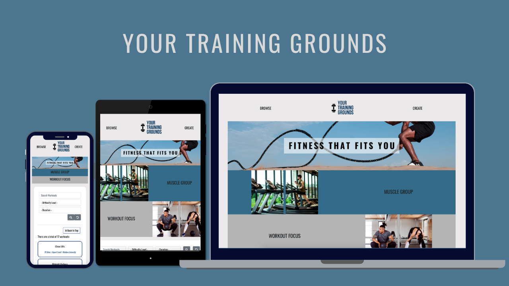
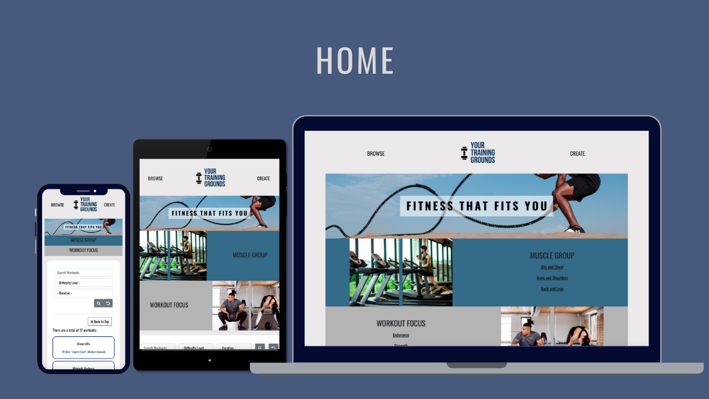
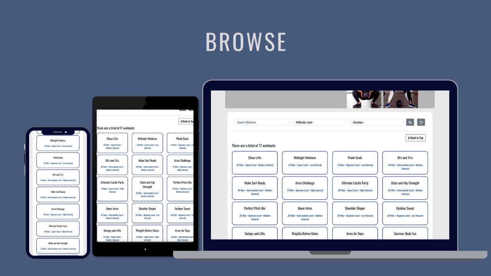
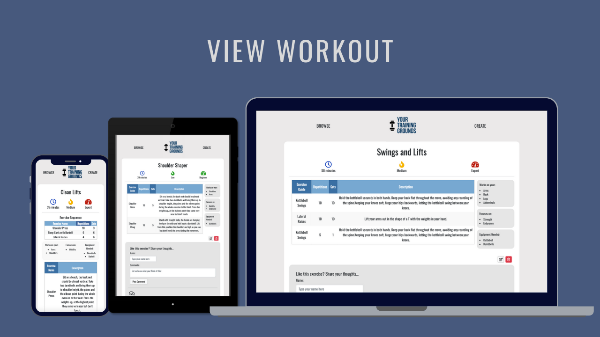
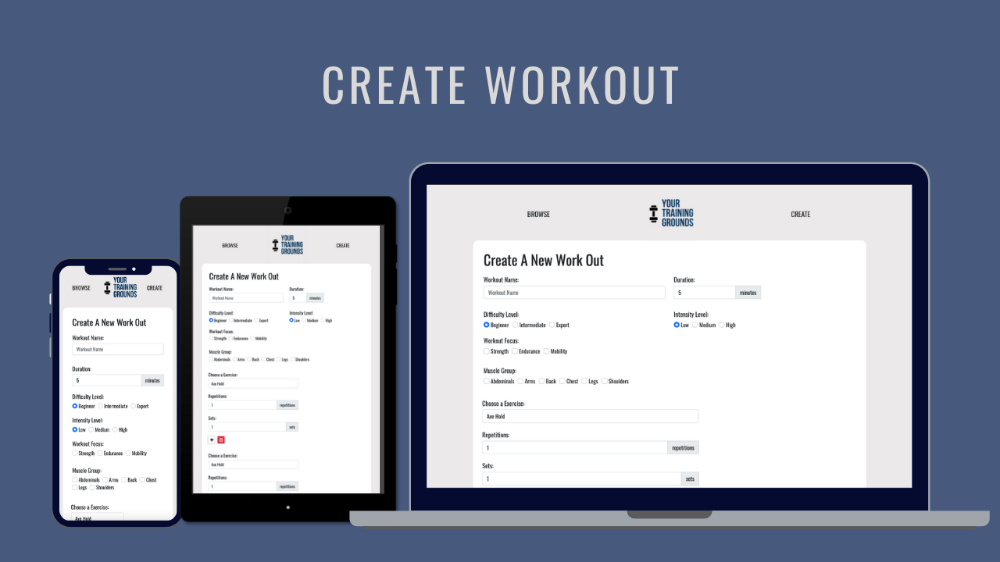

  

# Your Training Grounds
Can't think of what workout to do today? Want to share your workout with your friends?
Your Training Grounds will be able to help you out.

This web application can serve the following purpose: 
* Allows users to search, view and comment on different workouts.
* Users can create and share different workouts on the web application.
* See some mistakes that other users made? Users can help edit the workouts to make a smoother process for the next user who is interested in the workout.

## Context
Site Owner's Goals: This project aims to create an interactive web application using ReactJS and a RESTful API created by Mongo and Express. Moreover, this web app aims to promote healthy lifestyles, as it is a platform for different users to share the workouts that they do or enjoy.

User's Goals: To be able create, search, read, edit, delete and comment on different workouts and comments of the workouts. 

## Justification
There are many fitness and workout applications all over the internet, all created by the big corporations for different users to achieve very high standards. Your Training Grounds is on the contrary as the name suggests, it is based on you. It is based on your preference, your level, your goals. 
This platform allows users to try different workouts created by other users who are on the same level as them. No need to aim for those created by the fitness experts which might be very hard to follow or complete.
Users can also comment on the workouts to give other users an idea on their experience and what they think about it. If they see fit, they are also able to edit the workouts to make it more attainable for future users as well.
It is a platform where it is inclusive of anyone who wants to create their own training grounds.

## Express and Access

Live Site URL: https://yourtraininggrounds.netlify.app/

Github URL: https://github.com/mjpong/project2-workout-express

# Strategy

## Identifying External Users

As previously mentioned above, the primary users are people who want or have a healthy lifestyle. They can be categorized into two different categories:

* Users who want to share with the community the workouts that they did or enjoy by creating it on Your Training Grounds.
* Users who want to explore something new and try workouts that they have not done before by browsing or searching through Your Training Grounds. 

## User Stories

| User Stories | Acceptance Criteria |
| ------------ | ------------------- |
| Having a busy work schedule, it is very hard to fit a good short workout in during the day, all the workouts I see online are all very long and not fit for me. | Filter feature to filter by time and duration |
| I would like to see how other people feel about different workouts before I try it out so I know I can handle it. | Adding a comment function to different workouts for people to comment and view others as well |
| It would be nice to be able to browse different workouts based on muscle groups to see what I want to work on today. | Adding a browse category based on different muscle groups, categorizing them together |
| Sometimes on a rest day, it'll still be good to move a little bit, it'll be nice to be able to browse or search a workout based on the intensity or the level of the workout. | Adding a search or filter function based on the intensity level of the workout |
| I feel like other people would be able to enjoy the workout that I did therefore I would to have a platform to be able to share that. | Allowing users to create workouts and to click different categories for it to be a part of |

## User Goals
1. View all workouts.
2. Search to find out if the workout exists in the database.
3. View the main and key information in the selected workouts, such as the the description of the workout, the different workout focuses, intensity level etc.
4. Post comments on different workouts on the web app.
5. Create a new workout.

# Scope / UIUX

## Functional Requirement
1. Database to hold all the require information.
2. Users are able to search based on key parameters to see if the workout exists.
3. User are able to browse through different filters of the workouts 
4. Users are able to create, read, update and delete workouts.
5. Users are able to create, read, update and delete comments.
6. Navigation bar to be able to toggle between different pages within 3 clicks.
6. Mobile responsive to different size devices. 

## Non-Functional Requirement
1. Performance
2. Readability

# Structure and Features
## Mandatory Content Requirement
Requirements for the site to meet the different user goals mentioned above.
1. Browse layout for an overview for all the different workouts.
2. Search function to search for all the different workouts.
3. View workout page with all the description and data, such as duration, intensity, focus, muscle group, single exercises, description, sets and reps.
4. Comment section in each single workout, with the name and the comment.
5. Create workout form with all the different categories, forms, checkboxes and radio buttons for users to create the specific workout.

## Content Information
This information is necessary to fulfil all the mandatory content requirement, the information will be repeated and shared across different pages. This is all based on the ER Diagram created for this project.

  

As this is a one page web application with a linear structure, all the elements are less than 3 clicks away.

## Navigation
Navigation between different elements can also be done using the nav bar provided at the top.

## Browse All Workouts
  
  
The browse page is also the home page of this web app. The page consists of the following:
1. Banner image with a tag line - "Fitness that fits you"
2. Browse By Categories - showing the filter categories on click :
    * Muscle Group - Abs and Chest, Arms and Shoulders, Back and Legs
    * Workout Focus - Endurance, Strength Mobility
3. Search and Filter Bar where users can:
    * Search by the workout name, focus, difficulty, intensity, muscle group
    * Filter by difficulty level
    * Filter by duration
    * Search and filters can be done at the same time
4. View all the workouts 
    * When there is no filter or search, that part will show all the workouts in the database
    * When search or filter is enforced, the filtered workouts will show in that part
    * Users can click on the workouts that will lead to the View Individual Workout page

## View Individual Workout
  
The view individual workout page is the page that has all the details for that specific workout. The page consists of the following:
1. Workout Name
2. Description Tags
    * Duration, Intensity, Difficulty
    * Muscle Groups, Workout Focus, Equipment
3. Exercise Guide and Description
    * Repetitions
    * Sets
4. Comment Section
    * Create comment section
    * Comment List

## Create A Workout
  
This is the page where you can create a new workout. The page consists of a form that include everything above other than the comments. The page consists of the following:
1. Workout Name
2. Description Tags
    * Duration, Intensity, Difficulty
    * Muscle Groups, Workout Focus
3. Exercise Guide and Description
    * Repetitions
    * Sets
    * Users can add more than one exercise 

## Mobile Responsive
All the elements in this one page web application is responsive across various devices, the component will automatically arrange itself based on the screen size:
* Laptop - landscape mode
* iPad / Tablet - landscape / portrait mode
* iPhone / Smart Phone - portrait mode

## Limitations and future implementations
Some future implementations that I would like to add to this web application: 
1. Currently, because of data integrity, I had limited the "Single Exercises" that can be chosen and users cannot input their own. In the future, I would want to add an entry form where users can submit their "Single Exercises" that they would like to add, and after confirming the data and description is correct, I would then add that selection to the single exercises menu for users to have a wider selection.
2. As the description part seems a bit cramped in a table, another idea I would like to input for the future is either added an image of the single exercise or a video / link of the video to the exercise so the user will be able to have a video example to follow in case they do not know how to do the exercise.
3. As currently, any user can edit and delete other users workouts and comments. I would like to implement a user account feature to make sure they the entries are all in track and users are only allowed to edit and delete their own posts.
4. As some exercises for example swimmming or planks, it is measured under length and time. I would like to add another unit of measure for users to add other than just "sets" and "reps". They would be able to enter the length of the swim or the time of the plank exercise.

# Surface
## Color
  
This color scheme was put together by [canva](www.canva.com) and is used for the main theme for the whole web page.
Blue is most often known for representing trust and stability. It also boosts productivity and can encourage people to do more at the gym. Therefore it is used over the webpage as it is associated with exercise, fitness and working out.

## Typography
* Oswald font is used for the body of the text in the webpage. The font gives off a very strong sense and supports the whole base of the web app. 

* Font size is set to adjust according to the different device size, easier to read and understand.

## Icons
FontAwesome icons were used to for the tags in order to show a contrast from just the words and to give a different style in the view workout page.

# Testing
## Functionality Testing 
## Browse Page
|Category |Input/Actions/Items | Output/Errors |
|:---------|:----------------------|:---------------------|
|Overall  | On Load | "No Results Found" will show until the DB loads the workouts |
|Browse Buttons | On Hover | Animation both on and off hover checks|
|Browse Buttons | On Click | Div for filters both shows and hides on click |
|Search Bar | Typing into "Search Workouts" | The space will capture the text, and will not be searched until clicked search |
|Search Bar | Typing into "Search Workouts" | After searching, if the text area is cleared and search button is clicked again, it shows all results |
|Search Bar | Search criteria | Search results show for entries under "All Workouts" - "Beach Body" Shows the results, until there are no workouts |
|Search Bar | Search criteria | Search results show for entries under "Workout Focus" - "Endurance" Shows the results, until there are no workouts |
|Search Bar | Search criteria | Search results show for entries under "Workout Intensity" Shows the results, until there are no workouts |
|Filter Search | Filter Difficulty | Drop down will change to the selected difficulty level |
|Filter Search | Filter Duration | Drop down will change to the selected duration |
|Filter Search | All 3 criteria met | Items will search with 3 criteria, or just 2 criteria, or just 1 as well when search is clicked|
|Reset Button | On Click | Resets all criteria and shows all workouts again |
|Back to Top Button | On Click | Back up to browse |

## View Workout Page
|Category |Input/Actions/Items | Output/Errors |
|:---------|:----------------------|:---------------------|
|Exercise Guide | Exercises | Renders the different exercises and descriptions |
|Tags Icons | Color | Changes colors according to the 3 level differences |
| Tag Cards | Muscle render | Shows the muscle checkboxes clicked | 
| Tag Cards | Focus render | Shows the focus checkboxes clicked | 
| Tag Cards | Equipment render | Shows the equipment from the single exercise db | 
| Comment Section | Text input | Comment won't be posted under clicked |
| Edit Workout | On Click | Brings to create workout form with all the values already input. Form validation also is intact for the edit workout|
| Edit Workout | Update | Brings user back to view workout with updated data|

## Create Workout Page
|Category |Input/Actions/Items | Output/Errors |
|:---------|:----------------------|:---------------------|
|Form fields| Text input | All forms will be updated as the user is typing |
|Radio Buttons|On load | At least one radio button will already be checked to help with form validation |
|Check boxes| On load | Muscle group will be loaded after data is rendered |
| Single Exercise Section | Add Button | Will add a new section below with "Exercise, Reps, Sets" as a section |
| Single Exercise Section | Delete Button | The newest section will be deleted |
|Workout Form| Form Validation | Form fields must be filled in, certain values must be met, at least 1 checkboxes must be checked |

## Mobile Responsive
|Category |Input/Actions/Items | Output/Errors |
|:---------|:----------------------|:---------------------|
| ViewWorkout| Exercise Guide | Separates to two tables to make it easier to view in mobile view |
| Font size | Size | Font is smaller in mobile / tablet devices |
|Browse | Workouts | Bootstrap columns in place to show different views as screen goes smaller | 
| Browse | Banner images | 

# Technologies Used
* HTML
* CSS
* Javascript
* ReactJS
* [mongoDB](https://www.mongodb.com) to store all data
* [axios](https://github.com/axios/axios) for getting the data from mongodb 

For styling:
* [Bootstrap](https://getbootstrap.com) for main layout design, navbar, create form
* [Fontawesome](https://fontawesome.com/) for the different icons
* [Canva](https://www.canva.com) for the color theme and the mockup images for different devices, and to create a logo
* [Google Font](https://fonts.google.com/) for the font scheme

For deployment: 
* [Github] (https://github.com)
* [netlify](https://www.netlify.com) to deploy react application
* [heroku](https://www.heroku.com) to deploy express application

# Deployment
### React:
This web app is hosted by Netlify.
[TGC's react deployment guide](https://docs.google.com/document/d/1cquGsm1x8Tm2vzcJcAxQdnCe_BxF9b9z34vQEJ6-K7E/edit)
Data sets are store in Heroku and are called automatically. It may take up to thirty seconds for data set to be loaded. 
Apart from React default package. Ensure you have the following depencencies. 
* axios
* bootstrap
* react-router-dom

**Steps for deployment:**
1. All edits were added, commited, and pushed to GitHub via Gitpod.
2. In the terminal, type `yarn build`
3. Download the build folder to desktop.
4. Go to https://www.netlify.com/ and log in with Github account.
5. Click on "Sites" button.
6. Drag the entire folder "build" to the box in sites. 
7. Click on "Deploy site" button to get a link for the deployed site.

### Express:
This express side is hosted by Heroku. 
[TGC's express deployment guide](https://docs.google.com/document/d/1-O-m7KGG_8GrKb0QwuuVRI9iGk_xmE8mMyqR0w_2JVs/edit) 
 

## Credits

* [pexels](https://www.pexels.com) for the banner images
* Deployed react with build through instructions from [TGC's react deployment guide](https://docs.google.com/document/d/1cquGsm1x8Tm2vzcJcAxQdnCe_BxF9b9z34vQEJ6-K7E/edit), put together by Paul Chor.
* Deployed react with build through instructions from [TGC's express deployment guide](https://docs.google.com/document/d/1-O-m7KGG_8GrKb0QwuuVRI9iGk_xmE8mMyqR0w_2JVs/edit), put together by Paul Chor.
