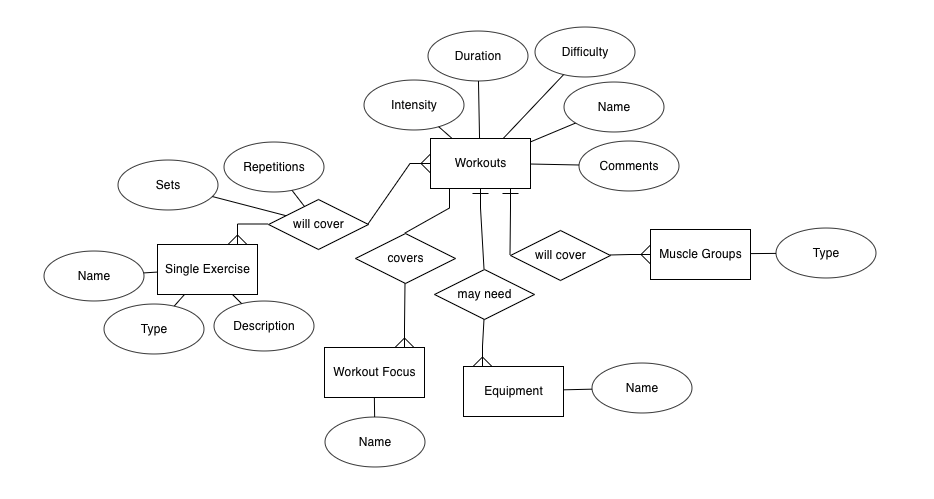

# Your Training Grounds
Can't think of what workout to do today? Want to share your workout with your friends?
Your Training Grounds will be able to help you out.

This web application can serve the following purpose: 
* Allows users to search, view and comment on different workouts.
* Users can create and share different workouts on the web application.
* See some mistakes that other users made? Users can help edit the workouts to make a smoother process for the next user who is interested in the workout.

## Context
Site Owner's Goals: This project aims to create an interactive web application using ReactJS and a RESTful API created by Mongo and Express. Moreover, this web app aims to promote healthy lifestyles, as it is a platform for different users to share the workouts that they do or enjoy.

User's Goals: To be able create, search, read, edit, delete and comment on different workouts and comments of the workouts. 

## Web App Justification
There are many fitness and workout applications all over the internet, all created by the big corporations for different users to achieve very high standards. Your Training Grounds is on the contrary as the name suggests, it is based on you. It is based on your preference, your level, your goals. 
This platform allows users to try different workouts created by other users who are on the same level as them. No need to aim for those created by the fitness experts which might be very hard to follow or complete.
Users can also comment on the workouts to give other users an idea on their experience and what they think about it. If they see fit, they are also able to edit the workouts to make it more attainable for future users as well.
It is a platform where it is inclusive of anyone who wants to create their own training grounds.

## Express and Access

Live Site URL: 

Github URL: https://github.com/mjpong/project2-workout-express

BROWSE IMAGE

# Strategy

## Identifying External Users

As previously mentioned above, the primary users are people who want or have a healthy lifestyle. They can be categorized into two different categories:

* Users who want to share with the community the workouts that they did or enjoy by creating it on Your Training Grounds.
* Users who want to explore something new and try workouts that they have not done before by browsing or searching through Your Training Grounds. 

## User Stories

| User Stories | Acceptance Criteria |
| ------------ | ------------------- |
| Having a busy work schedule, it is very hard to fit a good short workout in during the day, all the workouts I see online are all very long and not fit for me. | Filter feature to filter by time and duration |
| I would like to see how other people feel about different workouts before I try it out so I know I can handle it. | Adding a comment function to different workouts for people to comment and view others as well |
| It would be nice to be able to browse different workouts based on muscle groups to see what I want to work on today. | Adding a browse category based on different muscle groups, categorizing them together |
| Sometimes on a rest day, it'll still be good to move a little bit, it'll be nice to be able to browse or search a workout based on the intensity or the level of the workout. | Adding a search or filter function based on the intensity level of the workout |
| I feel like other people would be able to enjoy the workout that I did therefore I would to have a platform to be able to share that. | Allowing users to create workouts and to click different categories for it to be a part of |
git ad
## User Goals
1. View all workouts.
2. Search to find out if the workout exists in the database.
3. View the main and key information in the selected workouts, such as the the description of the workout, the different workout focuses, intensity level etc.
4. Post comments on different workouts on the web app.
5. Create a new workout.

# Scope

## Functional Requirement
1. Database to hold all the require information.
2. Users are able to search based on key parameters to see if the workout exists.
3. User are able to browse through different filters of the workouts 
4. Users are able to create, read, update and delete workouts.
5. Users are able to create, read, update and delete comments.
6. Navigation bar to be able to toggle between different pages within 3 clicks.
6. Mobile responsive to different size devices. 

## Non-Functional Requirement
1. Performance
2. Readbility

## Content Requirement

### Mandatory Requirement

Requirements for the site to meet the different user goals mentioned above.
1. Browse layout for an overview for all the different workouts.
2. Search function to search for all the different workouts.
3. View workout page with all the description and data, such as duration, intensity, focus, muscle group, single exercises, description, sets and reps.
4. Comment section in each single workout, with the name and the comment.
5. Create workout form with all the different categories, forms, checkboxes and radio buttons for users to create the specific workout.

# Structure 
## Content Information
This information is necessary to fulfil all the mandatory content requirement, the information will be repeated and shared across different pages. This is all based on the ER Diagram created for this project.

  

As this is a one page web application with a linear structure, all the elements are less than 3 clicks away.
## Navigation
Navigation between different elements can also be done using the nav bar provided at the top.

## Browse All Workouts
The browse page is also the home page of this web app. The page consists of the following:
1. Banner image with a tag line - "Fitness that fits you"
2. Browse By Categories - showing the filter categories on click :
    * Muscle Group - Abs and Chest, Arms and Shoulders, Back and Legs
    * Workout Focus - Endurance, Strength Mobility
3. Search and Filter Bar where users can:
    * Search by the workout name, focus, difficulty, intensity, muscle group
    * Filter by difficulty level
    * Filter by duration
    * Search and filters can be done at the same time
4. View all the workouts 
    * When there is no filter or search, that part will show all the workouts in the database
    * When search or filter is enforced, the filtered workouts will show in that part
    * Users can click on the workouts that will lead to the View Individual Workout page

## View Individual Workout
The view individual workout page is the page that has all the details for that specific workout

## Create A Workout
This is the Create Workout Form page